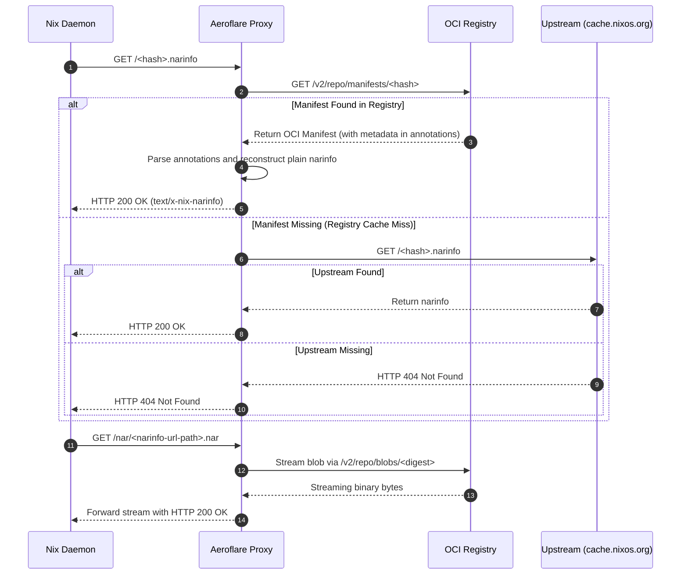

# Architecture & Design Decisions

Aeroflare is designed to map the standard Nix Binary Cache protocol directly onto modern container registries and object storage, bypassing the need for dedicated cache hardware or stateful databases.

## High-Level Subsystems

1. **Proxy Daemon (`aeroflare run` or `aeroflare proxy`)**: Intercepts HTTP requests from the local Nix daemon for `.narinfo` files and `.nar` blobs.
2. **OCI Network Layer**: Translates Nix metadata into OCI registry primitives (Manifests and Layers).
3. **Provisioning Wizard**: Configures upstream infrastructure (Cloudflare R2 or GitHub Container Registry) natively.

## Nix Substitution Sequence Diagram

The sequence below maps out how a Nix Daemon queries the local Aeroflare proxy, which translates the request to OCI manifest retrievals:

## Design Invariants

### 1. Stateless Proxying
The Aeroflare proxy server retains strictly zero local state for cached binaries. It relies entirely on the remote OCI registry as the source of truth. When a request comes in for a cache miss, Aeroflare falls back to upstream (like `cache.nixos.org`) or streams the blob directly from the OCI backend without buffering the entire file to local disk.

### 2. O(1) Manifest Lookups
To provide high-performance metadata resolution, Aeroflare utilizes an **O(1) Lookup Tagging Rule**. When pushing a NAR to the OCI registry, the OCI Image is tagged precisely with the 32-character Nix store hash (e.g., `xn2nlmvng2im9mgrq46y3wkbz4ll1hnp`). When the Nix daemon subsequently requests `<hash>.narinfo`, the proxy directly pulls `registry/repository:<hash>`, making metadata lookups instantaneous without requiring an external index database.

### 3. Execution Wrapping
Instead of requiring users to manage proxy lifecycles manually, Aeroflare provides the `run` execution wrapper. This ephemeral proxy starts up just before a `nix build` command, injects itself as a substituter via Nix configuration flags, and then uploads any resulting output paths post-build.
